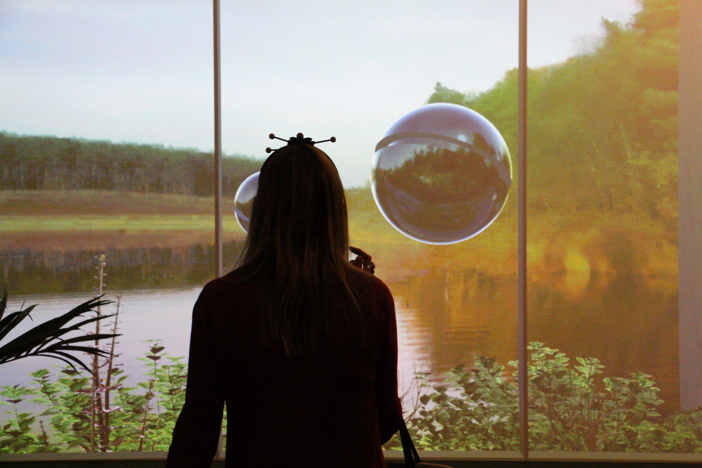
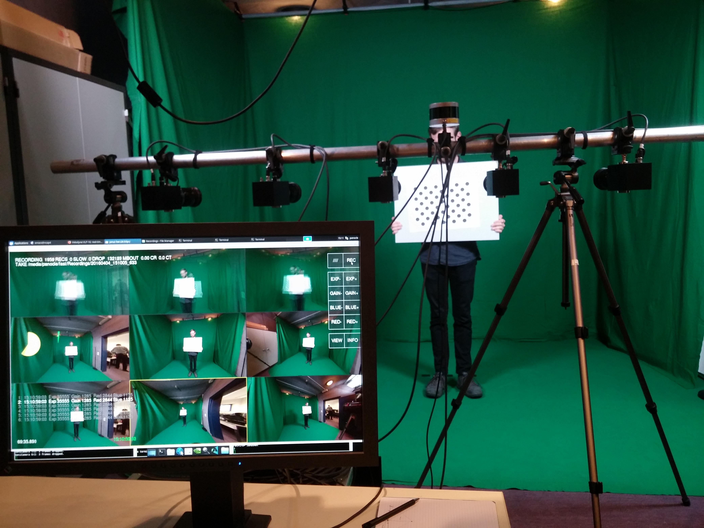
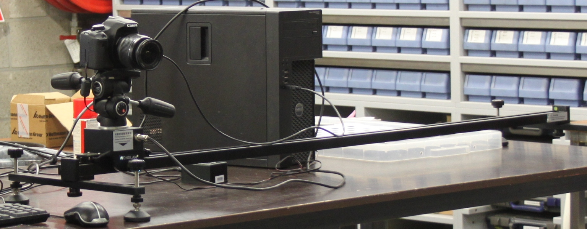
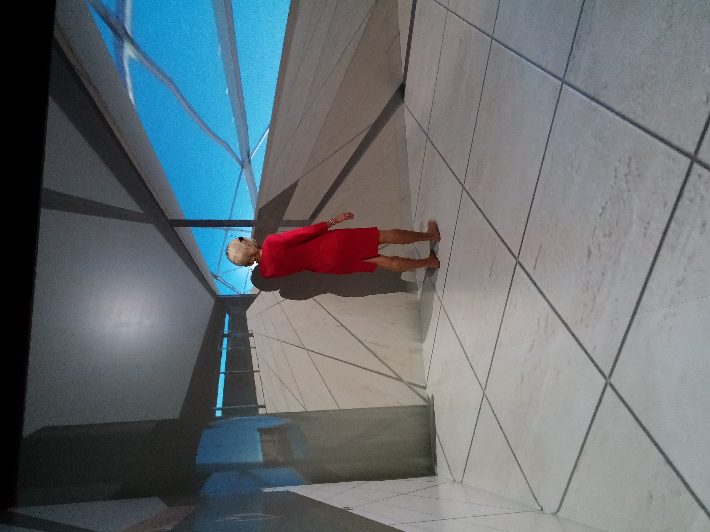
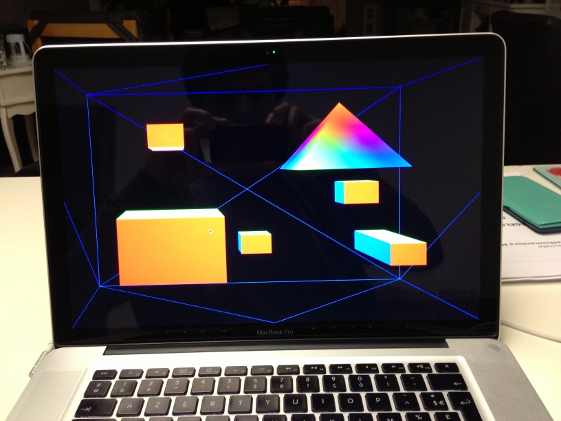
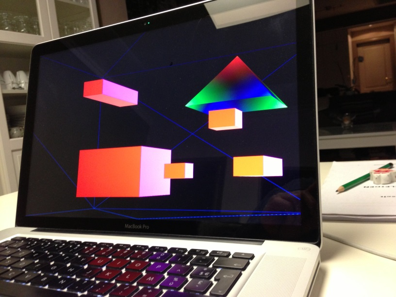

*2009-2019: Research at UHasselt*

Creating a 3D effect can be done with 2D screens only (and a tracker). By following the head of the viewer and adapting the image based on the viewpoint, we create a "window" effect, where it seems the viewer is looking through the screen to a 3D scene. The adapted images are either rendered as a 3D model, or recreated real images using view interpolation, or the closest image available.

## Capture and data processing

We used a few methods to capture and generate sufficient data for the 3D representation of the 2D data.

**Capture a dynamic scene using static cameras and use view interpolation to generate in-between views**

**Capture an object using a camera on a rail**

**Build a custom 3D scanner and capture the object from each angle
<iframe width="560" height="315" src="https://www.youtube.com/embed/-USIgAw_oH8?si=xrwMoXuXQk8dKRmP" title="YouTube video player" frameborder="0" allow="accelerometer; autoplay; clipboard-write; encrypted-media; gyroscope; picture-in-picture; web-share" referrerpolicy="strict-origin-when-cross-origin" allowfullscreen></iframe> 

## Display

Display is done by determining the position of the eyes and then render the scene as required.

**VR with head tracking**: See video above

**CAVE setup (2 walls and the floor) with OptiTrack**

<iframe width="560" height="315" src="https://www.youtube.com/embed/QRZuBx4Q4c0?si=6zPxvi8L8fHcbBVG" title="YouTube video player" frameborder="0" allow="accelerometer; autoplay; clipboard-write; encrypted-media; gyroscope; picture-in-picture; web-share" referrerpolicy="strict-origin-when-cross-origin" allowfullscreen></iframe> 

**Single screen with optitrack**
<iframe width="560" height="315" src="https://www.youtube.com/embed/-GaVHwheuew?si=ccF0-AmQiweZWke3" title="YouTube video player" frameborder="0" allow="accelerometer; autoplay; clipboard-write; encrypted-media; gyroscope; picture-in-picture; web-share" referrerpolicy="strict-origin-when-cross-origin" allowfullscreen></iframe> 

**Web viewer using WebGL and the webcam** ([paper here](https://github.com/pgoorts/Portfolio/raw/refs/heads/main/files/Publications/goorts2013bringing.pdf))

