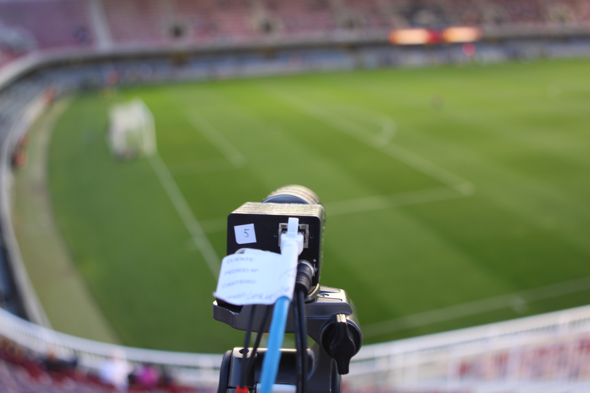
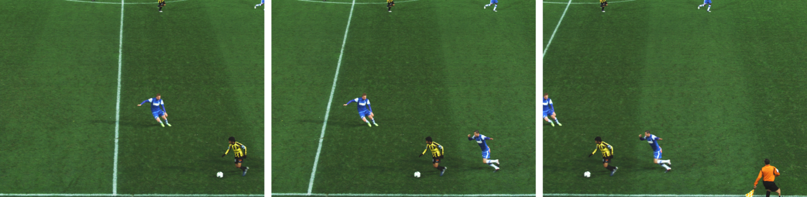
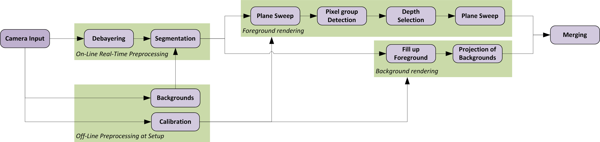
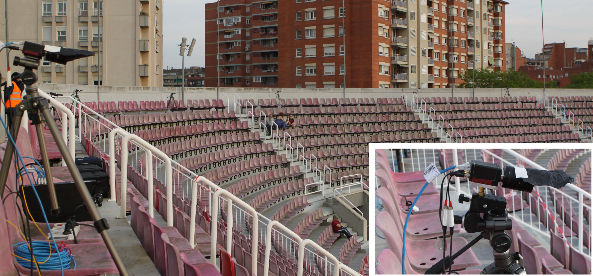
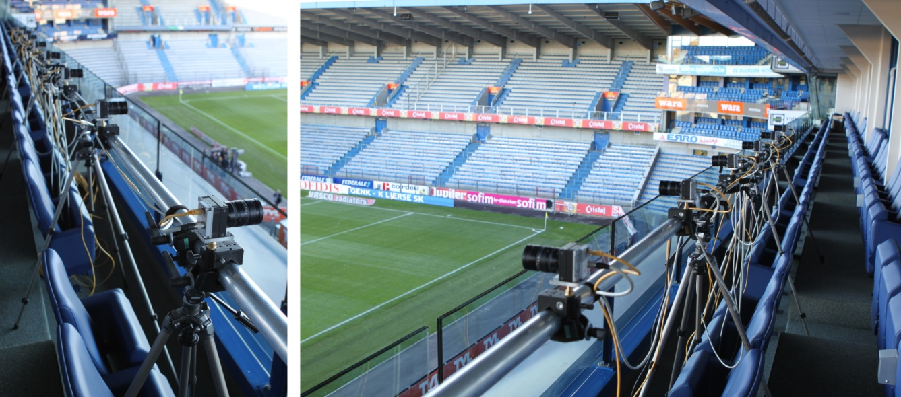
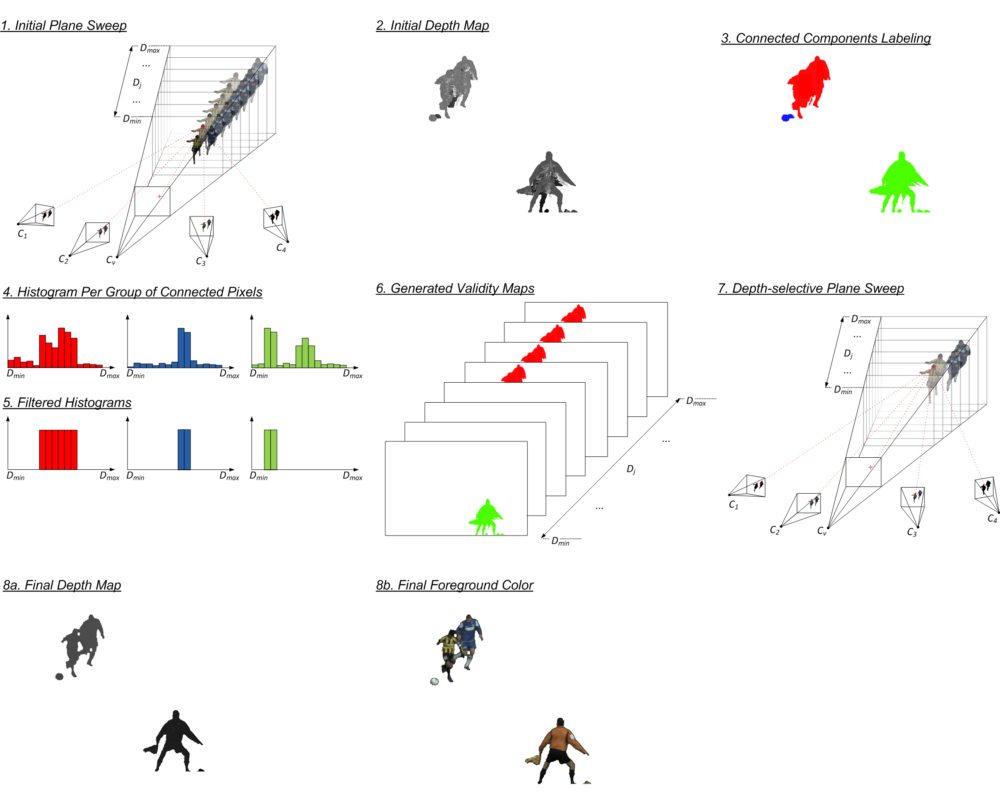

This project aims to increase the viewpoints available in sport scenes, especially for broadcasting. Current sports broadcasting has cameras on fixed locations, and the video stream cannot be changed after it's done. We aim to increase flexibility by generating novel views based on existing camera views, in real time, with minimal latency, on commodity hardware.

To do this, we use view interpolation, a technique where new images are generated based on existing images, without a conversion to 3D. This is because 3D reconstruction can be slow and will lose details.

Please note this project is before the existence of Gaussian splats and similar, and view interpolation got replaced by numerous machine learning methods. The question if classical computer vision methods still have a place in the current world is open for discussion, and I believe the answer is still yes.

# Results

With a virtual camera with novel, non-existing views, we can: 

* Move smoothly from one point to the others. This helps to maintain spatial context.
* Freeze a frame and have a look from some other angle. This is impossible with existing cameras.
* Go back to some action which a conventional camera with operator might have missed.

## PhD

This project was presented as a PhD thesis in 2014. You can find the text [here](https://github.com/pgoorts/Portfolio/raw/refs/heads/main/files/phd/PatrikGoorts-PhD-final.pdf).

You can find all the images [here](https://github.com/pgoorts/Portfolio/raw/refs/heads/main/files/phd/images) ([Zip](https://github.com/pgoorts/Portfolio/raw/refs/heads/main/files/phd/images.zip)). 

Here are some overview videos of results and the method used

<iframe width="560" height="315" src="https://www.youtube.com/embed/6MzeXeavE1s?si=54aarhHd4QoBm3Jw" title="YouTube video player" frameborder="0" allow="accelerometer; autoplay; clipboard-write; encrypted-media; gyroscope; picture-in-picture; web-share" referrerpolicy="strict-origin-when-cross-origin" allowfullscreen></iframe>

<iframe width="560" height="315" src="https://www.youtube.com/embed/y_jeFam1p5c?si=79pk76S-cZaXLfD8" title="YouTube video player" frameborder="0" allow="accelerometer; autoplay; clipboard-write; encrypted-media; gyroscope; picture-in-picture; web-share" referrerpolicy="strict-origin-when-cross-origin" allowfullscreen></iframe>

# Method

## Setup

We place cameras around the field. These are static, pointed to overlapping pieces of the scene, and timesynced.

The location of the cameras must be known. We use feature detection and matching on the scene, use domain-specific filtering to reduce outliers, and use bundle adjustment to get the relevant calibration.

Moving cameras using PTZ cameras or live calibration is feasible, but not attempted in this project.

## View interpolation

We use a version of plane sweeping for the view interpolation. We choose a location of a virtual camera, where we want the image from. We divide the space before this camera in planes, at different depths. We project the real camera images on these planes and note where the image is the sharpest. This is different per element in the scene. Lastly, we keep the projection with the sharpest image and discard the rest. We also note which plane this came from, thus effectively creating a depth map.

For sport scenes, we use various techniques to improve this method, including segmentation, separate rendering of foreground and background, player matching, depth map cleanup, and others.

The whole rendering pipeline (besides calibration) is realized in CUDA, making the method realtime and low latency.

# Publications

* Automatic Calibration of Soccer Scenes Using Feature Detection (2015) 
* Optimal Distribution of Computational Power in Free Viewpoint Interpolation by Depth Hypothesis Density Adaptation in Plane Sweeping (2014) [Paper](https://github.com/pgoorts/Portfolio/raw/refs/heads/main/files/Publications/goorts2014optimal.pdf)
* Free Viewpoint Video for Soccer using Histogram-Based Validity Maps in Plane Sweeping (2014) [Paper](https://github.com/pgoorts/Portfolio/raw/refs/heads/main/files/Publications/goorts2014free.pdf)
* Self-Calibration of Large Scale Camera Networks (2014) [Paper](https://github.com/pgoorts/Portfolio/raw/refs/heads/main/files/Publications/goorts2014selfcalibration.pdf)
* Optimization of Free Viewpoint Interpolation by Applying Adaptive Depth Plane Distributions in Plane Sweeping (2013) [Paper](https://github.com/pgoorts/Portfolio/raw/refs/heads/main/files/Publications/goorts2013optimization.pdf)
* GPU-based View Interpolation for Smooth Camera Transitions in Soccer (2013) [Paper](https://github.com/pgoorts/Portfolio/raw/refs/heads/main/files/Publications/goorts2013gpu.pdf)
* Real-time Video-Based View Interpolation of Soccer Events using Depth-Selective Plane Sweeping (2013) [Paper](https://github.com/pgoorts/Portfolio/raw/refs/heads/main/files/Publications/goorts2013realtime.pdf)
* An End-to-end system for Free Viewpoint Video for Smooth Camera Transitions (2012) [Paper](https://github.com/pgoorts/Portfolio/raw/refs/heads/main/files/Publications/goorts2012end.pdf)
* Raw Camera Image Demosaicing using Finite Impulse Response Filtering on Commodity GPU Hardware using CUDA (2012) [Paper](https://github.com/pgoorts/Portfolio/raw/refs/heads/main/files/Publications/goorts2012raw.pdf)