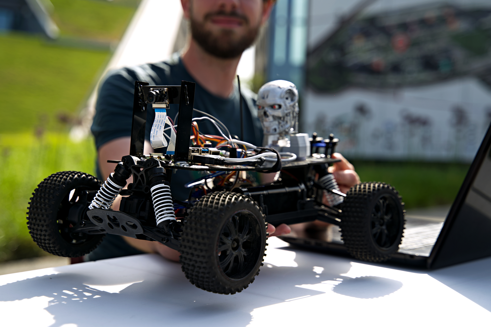
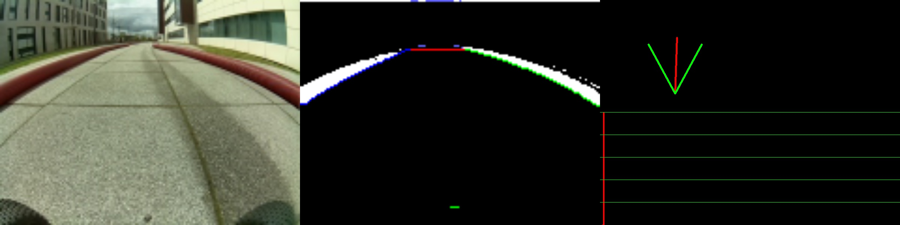

[See a video here](https://www.youtube.com/watch?v=d8669cn-0ss)

This competition is organized by Corda Campus, PXL-Digital and PXL-Voka Young & Strong.

Teams compete to develop the best and fastest algorithm to let an RC car fully autonomous around a track. Fastest arriving team wins. 

We competed using a custom track detector and predictor, together with a PID controller, to find the best route. We did not use machine learning here. A good predictive algorithm allowed us to increase the driving speed and let us win the competition 3 years in a row.

To iterate and develop fast, we designed a test framework that runs on a computer. This way, we avoid deploying to the hardware at each software iteration. Furthermore, we adapted to car to get more info we can use (i.e. current speed).

