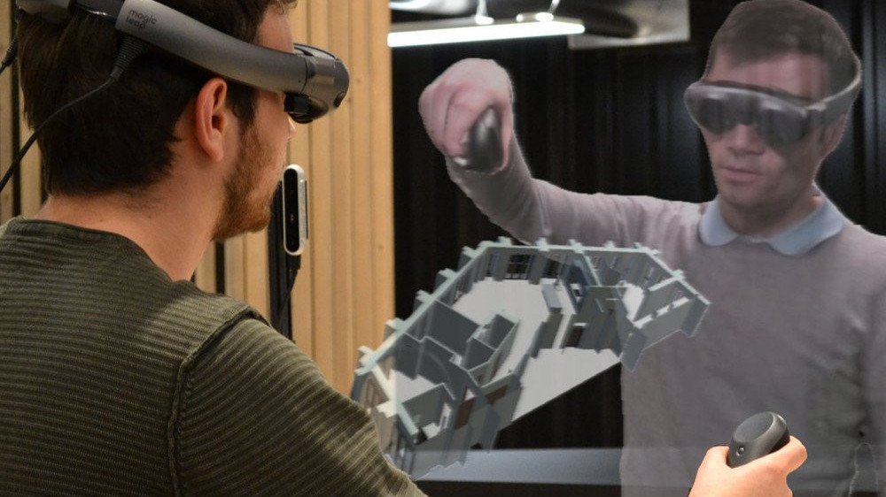
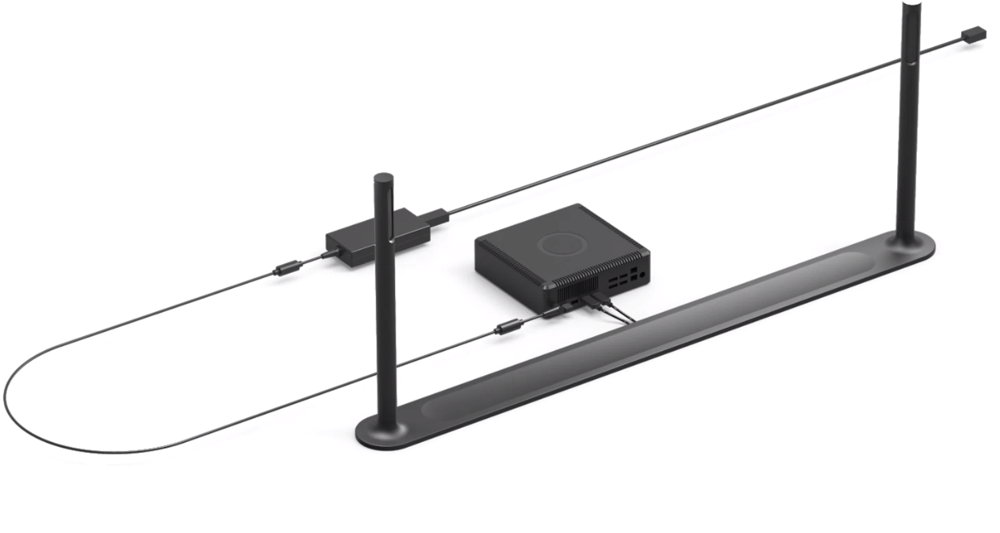

This project allows the live and realtime recording of persons in 3D and shows them in AR, using commodity depth cameras and processing hardware. This way, 2 or more persons can communicate in a more immersive and natural way, which is not possible in 2D video conferencing.

The method used a TSDF-based meshing algorithm using 2 or more depth cameras.

This project had many contributors. I worked on:

* Texture compression, simplification, and cleanup, for lower network traffic and a cleaner result
* Fully automatic depth camera calibration using facial features
* Improvement of the input depth maps, which results in a cleaner mesh
* Design and realize a settop box using Linux for deployment of the reconstruction software, while protecting our IP and prevent copying or tampering.

