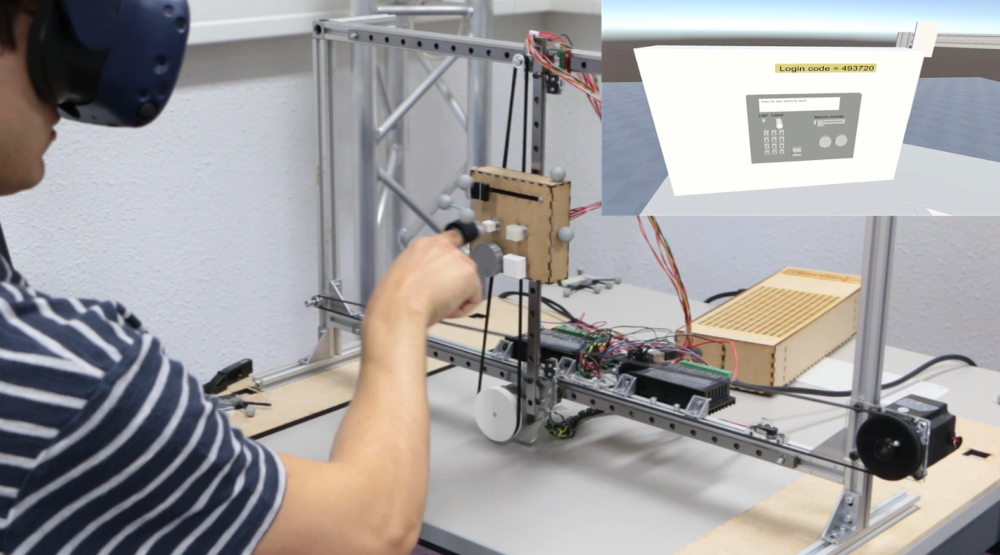

We built a system to prototype tactile interfaces without building every prototype. The tester sees the interface in VR, and a robot moves the relevant elements in front of the finger of the tester.

<iframe width="560" height="315" src="https://www.youtube.com/embed/lZdJ5Kv3Avg?si=GMz-r0O7-nyYmMtE" title="YouTube video player" frameborder="0" allow="accelerometer; autoplay; clipboard-write; encrypted-media; gyroscope; picture-in-picture; web-share" referrerpolicy="strict-origin-when-cross-origin" allowfullscreen></iframe>