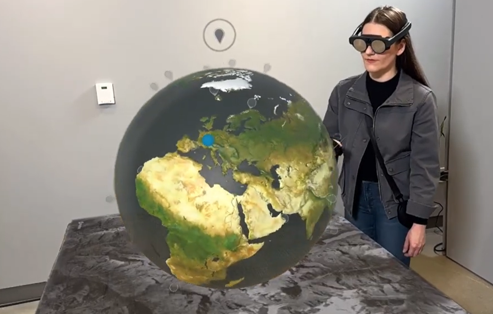
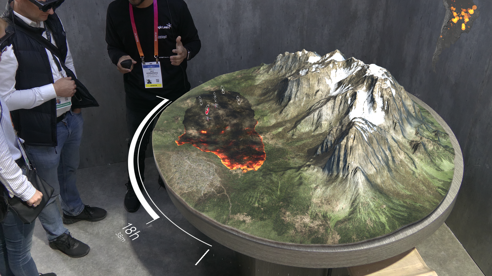

*2019-2026: Software engineer at Magic Leap*

<iframe width="560" height="315" src="https://www.youtube.com/embed/PfG9qleXIog?si=ApfNtzZ5MfLr2kZi" title="YouTube video player" frameborder="0" allow="accelerometer; autoplay; clipboard-write; encrypted-media; gyroscope; picture-in-picture; web-share" referrerpolicy="strict-origin-when-cross-origin" allowfullscreen></iframe> 

When using XR devices, only you can see what's going on. With a spectator app, you can connect to the XR device and see the real and virtual world from the position of your phone. You can make a professional recording for marketing using advanced video controls, or share a short clip with your friends.  For more advanced applications, we also built a spectator system with PTZ cameras (used on events and fairs), or depth cameras (for better composition).

This project had many contributors. I mostly worked on: 

* Functional app UI in Unity UI toolkit, with animations
* Connection negotiation using Bluetooth LE, and video connections using  WiFi aware and WiFi direct
* Zero copy ARCore camera pipeline (mapping Kotlin images, Vulkan textures and Unity textures to the same memory block), 4K@30FPS
* Professional camera controls (physical and post)
* Person segmentation for advanced compositing (Unity Sentis and ORT)

